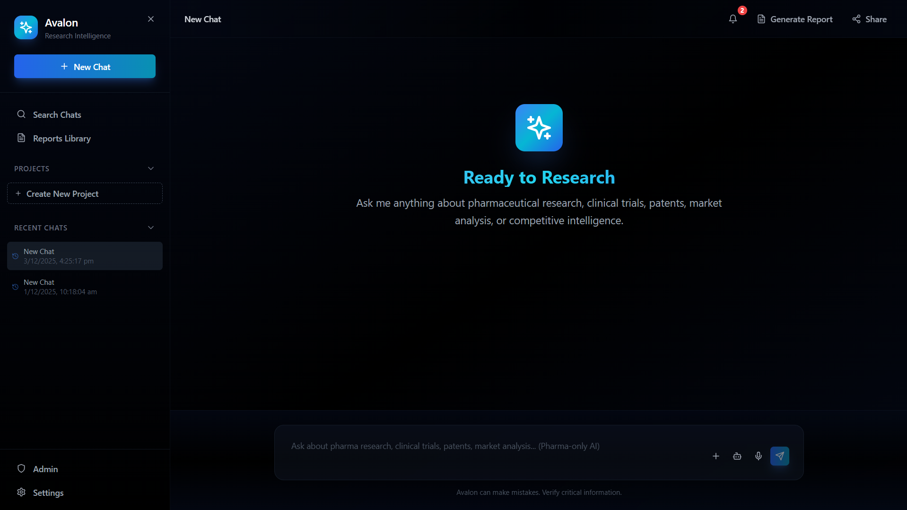

# Avalon: Elevating Healthcare


## Product Overview

**Avalon** is a purpose-built AI platform designed exclusively for clinical research, drug intelligence, patient safety, and pharmaceutical R&D. Unlike generic AI assistants, Avalon combines specialized pharmaceutical expertise with enterprise-grade security, enabling hospitals and research organizations to leverage AI capabilities while maintaining absolute patient data privacy.

Avalon transforms scattered medical knowledge into actionable intelligence across clinical research, treatment insights, safety analysis, and regulatory reasoning. The platform serves pharmaceutical companies, clinical research organizations, hospitals, and healthcare institutions that require deep medical reasoning capabilities with uncompromising security and compliance standards.

**Who Avalon Helps:**
- **Healthcare Institutions**: Hospitals and clinics requiring AI-powered clinical decision support with zero patient data exposure
- **Pharmaceutical Companies**: R&D teams, market intelligence analysts, and regulatory affairs professionals
- **Clinical Research Organizations**: Researchers conducting trials, analyzing evidence, and synthesizing medical literature
- **Regulatory Professionals**: Teams tracking approvals, interpreting guidelines, and preparing submissions

**Value Proposition:** Avalon delivers specialized pharmaceutical intelligence through a secure, local-first architecture. All Patient Health Information (PHI) is processed entirely on-premises, ensuring zero external data transmission while providing powerful multi-agent reasoning capabilities for comprehensive research analysis.

---

## Tech Stack

| Category | Technology |
|----------|------------|
| **Frontend** | React, TypeScript, Vite, TailwindCSS, shadcn/ui |
| **Backend** | Python, FastAPI |
| **Database** | MongoDB |
| **AI/LLM** | LM Studio (Local) |
| **Streaming** | Server-Sent Events (SSE) |
| **Graph Visualization** | Force-directed graphs, D3.js |
| **Authentication** | JWT-based session management (Currenlty disabled)|

---

## Key Features

### Multi-Agent Intelligence (Fully Implemented)

Avalon orchestrates specialized AI agents that work in parallel to deliver comprehensive pharmaceutical insights. The system intelligently routes queries to appropriate agents, synthesizes their findings, and presents unified, evidence-backed responses.

**Agent Flow:**
```
User Query
    ↓
Master Agent (Orchestration)
    ↓
┌─────────────────────────────────────────┐
│  Market Intelligence Agent              │
│  Clinical Trials Agent                  │
│  Patent Landscape Agent                 │
│  Safety & PK/PD Agent                   │
│  Web Intelligence Agent                 │
│  Internal Document Agent                │
│  Expert Network Agent                   │
│  EXIM Trends Agent                      │
└─────────────────────────────────────────┘
    ↓
Synthesized Response
```

Each agent specializes in its domain—from market intelligence to clinical trial analysis, patent landscapes to safety profiling—ensuring comprehensive coverage of pharmaceutical research questions.

### Local + Cloud Hybrid AI (Partially Implemented — model-dependent)

Avalon operates on a sophisticated hybrid architecture that prioritizes security and performance. Patient Health Information (PHI) and sensitive clinical data are processed entirely on-premises using local language models, ensuring zero data leaves your network. For non-PHI research queries requiring deep reasoning, Avalon can optionally leverage cloud-based models while maintaining strict compartmentalization.

**Key Benefits:**
- **Security First**: PHI never leaves your network
- **Performance Optimized**: Local processing for sensitive queries, cloud reasoning for deep research
- **Intelligent Routing**: Automatic selection of optimal execution engine based on query type and content

### Document Intelligence (Fully Implemented)

Upload PDFs, clinical trial documents, research papers, and internal reports. Avalon extracts structured insights, identifies key arguments, summarizes findings, and integrates document content into research queries. The system supports multiple formats including PDF, DOCX, TXT, and Markdown, with intelligent text extraction and analysis.

**Capabilities:**
- Multi-format document processing
- Structured insight extraction
- Context-aware analysis
- Seamless integration with research workflows

### Expert Graphs (Fully Implemented)

Avalon automatically builds knowledge graphs connecting researchers, institutions, clinical trials, and publications. These visual networks reveal collaboration patterns, expertise clusters, and research relationships that would be impossible to discover manually. Interactive graph visualizations help identify key opinion leaders, research gaps, and collaboration opportunities.

**Features:**
- Knowledge graph construction
- Expert identification and profiling
- Collaboration network analysis
- Key opinion leader (KOL) identification
- Interactive visualization

### Streaming Responses (Fully Implemented)

Experience live, token-by-token responses as Avalon processes your queries. The streaming interface provides immediate feedback, showing agent activity, reasoning steps, and findings as they emerge. This real-time visibility transforms the research experience from waiting for results to actively observing intelligence generation.

### Secure PHI Handling (Fully Implemented)

Patient Health Information is detected automatically and routed exclusively to local inference engines. Zero PHI data leaves the hospital network, ensuring compliance with HIPAA, GDPR, and other healthcare privacy regulations. The system maintains strict audit trails and access controls.

**Security Features:**
- Automatic PHI detection
- Local-only processing for sensitive data
- Complete audit trails
- Zero external data transmission for PHI queries

### Automated Reports (Partially Implemented — requires larger models or enterprise environment)

Generate enterprise-grade reports with a single click. Avalon compiles multi-agent findings into professionally formatted PDF documents with executive summaries, agent-by-agent sections, data tables, and source citations. CSV exports enable further analysis in Excel, Tableau, or other analytics tools.

**Report Features:**
- Professional PDF formatting
- Executive summaries
- Agent-by-agent sections
- Data tables and visualizations
- Source citations
- CSV export capabilities

### Project Workspaces (Fully Implemented)

Organize research activities into dedicated project workspaces. Each workspace maintains its own conversation history, uploaded documents, and research context, enabling teams to collaborate on specific research initiatives while maintaining clear separation between projects.

**Workspace Capabilities:**
- Isolated project environments
- Document management per project
- Conversation history tracking
- Team collaboration support

### Database Extensions (Fully Implemented)

Link external datasets and data sources to enhance research capabilities. Avalon supports integration with clinical trial databases, patent repositories, market intelligence sources, and custom data sources, enabling comprehensive analysis across multiple information streams.

**Integration Features:**
- Clinical trial database connectivity
- Patent database integration
- Market intelligence data sources
- Custom data source linking
- Real-time data retrieval

### Safe-Mode for Patient Queries (Fully Implemented)

Avalon intelligently adapts its behavior based on query type. Clinical Safety Mode is automatically activated for patient-specific queries containing PHI, ensuring all processing occurs locally with strict privacy controls. The system provides direct, actionable clinical guidance while maintaining absolute data security.

**Safety Mode Features:**
- Automatic PHI detection
- Local-only processing
- Clinical decision support
- Drug interaction checks
- Dosing recommendations
- Contraindication analysis

---

## High-Level Architecture

Avalon's architecture is designed around three core layers that work together to deliver secure, intelligent pharmaceutical research capabilities.

### Master Agent & Worker Agents

The **Master Agent** serves as the central orchestrator, performing critical functions:

- **Query Classification**: Determines whether queries fall within the pharmaceutical domain and identifies appropriate processing pathways
- **Task Decomposition**: Breaks complex research questions into discrete, parallelizable tasks
- **Worker Coordination**: Selects and activates specialized worker agents based on query content, managing parallel execution and handling failures gracefully
- **Synthesis Engine**: Combines worker agent outputs into coherent, structured responses with source attribution and evidence backing

**Worker Agents** are specialized AI experts, each focused on a specific pharmaceutical domain:
- Market Intelligence: Competitive landscape, market sizing, growth trends
- Clinical Trials: Trial analysis, phase tracking, endpoint evaluation
- Patent Landscape: IP analysis, expiration tracking, FTO assessment
- Safety & PK/PD: Pharmacological analysis, drug interactions, dosing guidance
- Web Intelligence: Regulatory updates, guideline identification, publication monitoring
- Internal Documents: Document processing, insight extraction, context integration
- Expert Networks: Knowledge graph construction, KOL identification, collaboration mapping
- EXIM Trends: Supply chain intelligence, manufacturing trends, trade flow analysis

### Local LLM Execution Layer

The **Local LLM Execution Layer** runs language models directly on your infrastructure, ensuring complete data control and privacy.

**Capabilities:**
- **PHI-Sensitive Processing**: All queries containing patient health information are processed exclusively by local models
- **Offline Safety Analysis**: Drug interactions, dosing calculations, and adverse event assessments occur entirely on-premises
- **Document Processing**: Text extraction and analysis from uploaded files happens locally
- **Real-time Inference**: Low-latency responses for common queries without network dependencies
- **Privacy-First Design**: Operates independently of internet connectivity, ensuring research continues during network outages

### Cloud LLM Execution Layer (Optional)

The **Cloud LLM Execution Layer** is an optional component designed for future activation, strictly gated for non-PHI queries only.

**When Enabled:**
- **Deep Reasoning Tasks**: Complex queries requiring extensive chain-of-thought reasoning and sophisticated synthesis
- **Advanced Literature Synthesis**: Large-scale literature reviews, meta-analyses, and comprehensive evidence synthesis
- **Market Analysis**: Deep market intelligence queries requiring extensive knowledge of global pharmaceutical markets
- **Patent Interpretation**: Complex patent claims analysis and intellectual property landscape assessments

**Security Gates:**
- PHI detection must pass (no patient data detected)
- Query must be classified as non-PHI research
- Feature flags must permit cloud routing
- Audit logs record all routing decisions

### Intelligent Engine Selection

Avalon automatically chooses which execution engine to use based on:
1. **PHI Detection**: Any detected patient information immediately routes to local processing
2. **Query Complexity**: Simple informational queries use local models; complex research questions may leverage cloud models if enabled
3. **Mode Classification**: Safety and patient modes always use local; research mode may use cloud for deep synthesis
4. **Feature Flags**: Administrators can enable or disable cloud routing based on organizational policies
5. **Network Conditions**: The system can fall back to local processing if cloud services are unavailable

This intelligent routing ensures optimal performance, security, and cost-effectiveness for each query type.

---

## Security & Privacy

Avalon is designed from the ground up to meet the stringent security and compliance requirements of healthcare and pharmaceutical organizations.

### Local Inference for PHI

All queries containing Patient Health Information (PHI) are automatically detected and processed exclusively on local language models. PHI detection uses pattern matching for patient identifiers, clinical measurements, medical history references, and treatment-specific patient data. Once PHI is detected, the query is immediately routed to the local LLM execution layer, ensuring zero external data transmission.

### Zero PHI Leaves Hospital Network

The architecture enforces strict network boundaries. PHI-containing queries never reach external APIs, cloud services, or third-party systems. All processing occurs within your infrastructure, behind your firewall, and under your direct control. Network monitoring and logging confirm that no PHI data is transmitted externally.

### Optional Cloud Pathway Only for Non-PHI Questions

The cloud LLM execution layer is strictly gated with multiple validation checks:
- PHI detection must pass (no patient data detected)
- Query must be classified as non-PHI research
- Feature flags must permit cloud routing
- Audit logs record all routing decisions

Even when cloud routing is enabled, the system defaults to local processing unless explicitly needed for deep synthesis tasks.

### Full Traceability

Every query generates a complete audit trail:
- **Timeline Events**: Step-by-step record of agent activation, task execution, and completion
- **Agent Attribution**: Each finding is attributed to its source agent
- **Source Citations**: External sources (publications, trials, patents) are tracked and cited
- **Routing Decisions**: Logs show why specific agents were selected and which execution engine was used
- **Error Tracking**: Failures, retries, and fallback behaviors are logged

This traceability enables compliance audits, quality assurance, and debugging.

### HIPAA-Aligned Architecture

Avalon's architecture aligns with HIPAA requirements through:
1. **Administrative Safeguards**: Role-based access controls, user authentication, and audit logging
2. **Physical Safeguards**: On-premises deployment options, network isolation, and infrastructure controls
3. **Technical Safeguards**: Encryption at rest and in transit, access controls, and PHI detection/routing
4. **Business Associate Considerations**: Clear data handling policies, breach notification procedures, and compliance documentation

The system is designed to support HIPAA compliance, though organizations should conduct their own compliance assessments based on specific use cases and regulatory requirements.

---

## Use Cases

### Hospital Safety Checks

Healthcare providers use Avalon for real-time clinical decision support, including drug interaction checks, dosing recommendations, and safety assessments for patient cases. All processing occurs locally with zero PHI exposure, enabling immediate clinical guidance while maintaining absolute patient privacy.

**Example Scenarios:**
- Drug interaction analysis for multi-drug regimens
- Dosing recommendations based on patient parameters
- Contraindication checks before prescribing
- Adverse event risk assessment

### Clinical Research

Research teams leverage Avalon for comprehensive evidence synthesis, clinical trial analysis, and literature reviews. The platform provides deep insights into trial designs, endpoints, safety profiles, and evidence gaps across multiple studies.

**Example Scenarios:**
- Active trial monitoring and phase analysis
- Cross-trial comparison and synthesis
- Evidence gap identification
- Regulatory designation tracking

### Pharma Market Analysis

Pharmaceutical companies use Avalon for competitive intelligence, market sizing, and strategic positioning. The platform delivers IQVIA-style insights on market dynamics, competitive landscapes, and growth projections.

**Example Scenarios:**
- Competitive landscape analysis
- Market size estimation and CAGR projections
- Key player identification and positioning
- Pipeline entrant analysis

### Patent & Trial Intelligence

IP teams and R&D professionals utilize Avalon for patent landscape reviews, freedom-to-operate assessments, and clinical trial intelligence. The platform provides comprehensive analysis of IP protection, expiration timelines, and trial evidence.

**Example Scenarios:**
- Patent family identification and analysis
- Freedom-to-operate assessments
- Expiration timeline tracking
- Clinical trial endpoint evaluation

### Document-Based Reasoning

Researchers upload clinical protocols, research papers, and internal documents for structured insight extraction. Avalon integrates document content into research queries, providing context-aware analysis and comprehensive synthesis.

**Example Scenarios:**
- Clinical protocol analysis
- Research paper summarization
- Internal report integration
- Multi-document synthesis

---

## Screenshots

### Dashboard Screenshot


### Multi-Agent Timeline Screenshot


### Research Insights Table Screenshot


### Expert Network Graph Screenshot(In Developing Phase)


### Report Generation Screenshot of PDF and CSV


---

## Disclaimer

This README describes the product vision and capabilities of Avalon. Some enterprise features, particularly those requiring deep reasoning or extensive synthesis, may require larger language models or secure enterprise infrastructure to achieve optimal performance. The platform is designed to scale from prototype implementations to full enterprise deployments based on organizational needs and infrastructure capabilities.

Avalon is built with security and compliance in mind, but organizations should conduct their own compliance assessments based on specific use cases, regulatory requirements, and organizational policies. No sensitive technical information, implementation details, or proprietary code is shared in this documentation.

---

## Contact Information

For inquiries about Avalon, enterprise deployments, or partnership opportunities, please contact:

Email: avalon.pharma.ai@gmail.com

linkedin: https://www.linkedin.com/in/abhay-singh-01dev

Website: Coming Soon

-

## Repository Status

Avalon is a **proprietary enterprise product**.

The full source code, backend systems, AI logic, and internal agent workflows are maintained in a private repository and are not publicly available.

**Publicly Available in This Repository:**

- High-level product documentation
- Feature overview
- User interface previews
- General architectural concepts (non-technical)

**Private and Confidential:**

- Complete application source code (frontend + backend)
- AI agent prompts and orchestration logic
- Data processing pipelines
- Matching and pricing engines
- PDF/CSV extraction systems
- Deployment configurations and infrastructure

This repository serves only as a public-facing overview of the AVALON platform.

---

Copyright 2025 Avalon. All rights reserved.

**Avalon** — Elevating Healthcare.
